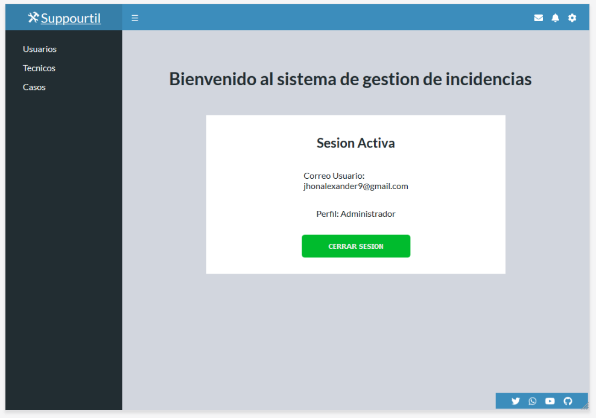

# About - Suppourtil

Proyecto Personal Platzi Master - Cohort 3 - Grupo Ana Belisa

## Project description

Web app proyect for suppourt app based on WEB

## Scope

This application want to help to business to create operate and resolve problems and issues in our organization

Este protecyo tendra como alcance la creacion de un sistema de gestion de casos para soporte tecnico

- Login para usuarios tanto administrador como usuario final
- Creacion y enrrolamiento de nuevos usuarios para el uso del aplicativo
- Creacion de servicios, los cuales tendran un area asignada, la cual a su vez tendra una prioridad de atencion (SLA)
- Creacion de nuevos eventos o issues, los cuales seran creados por el usuario final que sera el afectado y seran atendidos por los tecnicos luego de que el sistema automaticamente los asigne y asigne su prioridad
- Dashboard y gestion de cada caso donde cada tecnico podra ver los casos que debe operar y resolver dentro de el tiempo que el sistema asigno

## Creadores

- [Alexander Alvarez](https://github.com/DarkMefisto9)

---

## Wireframes

- [Login](https://docs.google.com/drawings/d/1C5p-O7dgvajtuP4iEs6gqUMlV4xsQa3-owzjTcNc8S4/edit)
- [Enrolar Nuevos Usuarios](https://docs.google.com/drawings/d/15ZLCanCcz9_doBW3zIYOb6zLJs4AWDXqvgP1TbFXxPU/edit)
- [Enrrolar Servicio](https://docs.google.com/drawings/d/11ic77P5cxew2Qw3OwEaUo-4SVGkpZ-i_5LfpIQ04xZk/edit)
- [Crear Evento Usuario](https://docs.google.com/drawings/d/1IoPNlx51YLBDSTdgetv1h_oMDPS-2GVbRfY_XkcOzJ8/edit)
- [Listado Casos - Agentes](https://docs.google.com/drawings/d/1HhM1ZzabrWv3KKZjjAhaNPNixjgbwXobqCMsRtqTuTc/edit)

## Entregas

### Viernes 26 Junio

- Wireframes

### Viernes 3 Julio

- Mockups

### Viernes 10 Julio

- Diseñar base de datos para el proyecto personal y entregar documentación del diseño de la base de datos

### Viernes 17 Julio

- Desarrollo del Backend del Proyecto (CRUD) + Entregable de al menos 2 acciones

### Viernes 24 Julio

- Entrega y Despliegue del Proyecto

### Viernes 31 Julio

- Entrega FInal

---

## How to Install

For install just need…

1. Download or clone the repository
2. install in your local machine

```jsx
npm install
```

## How Run in dev mode
```jsx
npm run start
```

## Test
```jsx
npm test
```

## Definiciones para el desarrollor

### Frontend

- Componentes created has NameOfComponent.jsx en ./src/components/Component.jsx
- Style for each component created in SASS has NameOfComponent.scss in ./src/assets/styles/components/Style.scss
- Test will be created has NameOfComponent.test.js in ./src/__test__/Test.test.js

## Technologies

### Frontend
- React based in components
- Sass how .scss

### Backend
- Node.js for ...
- PHP for ...

## Demo

You can see the demo live, [here](https://mastereatsplatzi.github.io/Master-Eats/)

## Image Preview



Image Preview

# License

This Food Market is released under the [MIT License](https://opensource.org/licenses/MIT).

### I born at 29/06/2020